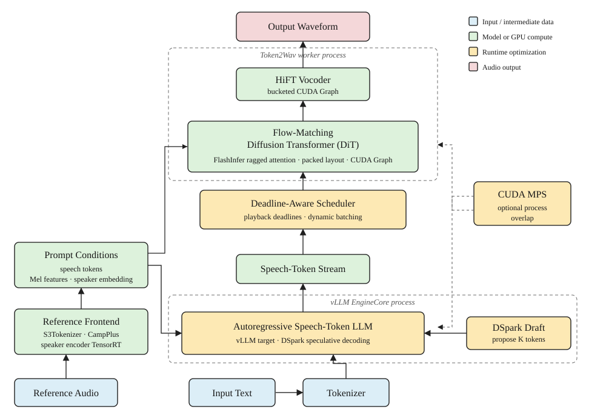

# Faster CosyVoice

## 项目介绍

Faster CosyVoice 是面向 NVIDIA GPU 的 CosyVoice3 高性能推理与服务实现。项目支持
CosyVoice3 的模型推理，围绕 speech-token LLM 与
DiT Flow matching Token-to-Wav 两阶段推理链做系统优化，重点改善流式合成的首包延迟、并发吞吐和
连续播放稳定性。

这套实现不仅关注单个 kernel 的速度，也处理两个阶段共享一张 GPU 时产生的资源竞争、
变长请求 padding 和流式任务调度问题。其中的大部分方法同样适用于其他
“LLM + flow matching”两阶段 TTS 系统。



主要加速手段包括：

- **DSpark speculative decoding**：draft model 一次提出多个 speech token，由 target
  LLM 并行验证，减少自回归 decode step。
- **FlashInfer DiT**：将 padded SDPA 改成 ragged attention，并融合 QKV、partial
  RoPE 和 AdaLN 相关操作；流式路径使用 chunk-causal custom mask。
- **跨请求 packed batching**：只拼接每条请求的有效 Mel frame，避免
  padding 带来的冗余计算。
- **Deadline-aware scheduling**：实时跟踪每条 stream 还能播放多久；
  即将耗尽的请求会优先调度，同时新请求的首 chunk 音频也会提高优先级处理。
- **CUDA Graph**：对 Flow matching 和 HiFT 模块开启 CUDA Graph，减少 kernel launch 开销。
- **CUDA MPS**：让 vLLM EngineCore 与 token2wav worker 两个 CUDA 进程在同一张卡上
  更细粒度地交错执行，进一步提高 GPU 效率。

## 快速开始

### 1. 安装

需要 Linux x86_64、CUDA 13 兼容驱动、Python 3.12 和
[uv](https://docs.astral.sh/uv/)。Debian/Ubuntu 容器需要预装
`build-essential libsndfile1 sox`。

```bash
git clone https://github.com/yuekaizhang/faster-cosyvoice.git
cd faster-cosyvoice
uv sync --frozen
```

### 2. 启动服务

```bash
uv run --frozen faster-cosyvoice-server \
  --host 0.0.0.0 \
  --port 8000 \
  --speaker-encoder-tensorrt \
  --speech-token-chunk-size 25 \
  --speech-token-chunk-growth 1 \
  --streaming-flow-graph-buckets 512,640,768,896,1024,1280 \
  --streaming-vocoder-graph-buckets 64,128,192,256,384,512
```

推荐部署配置：开启 LLM Speculative Decoding、FlashInfer Flow Matching、跨请求 packed batching、
deadline-aware scheduler、Flow/HiFT CUDA Graph 和 speaker encoder TensorRT。
CUDA MPS 需要单独在服务进程外启动。

### 3. 发送流式请求

下面的请求直接携带参考音频，不需要提前注册音色：

```bash
uv run --frozen python examples/stream_client.py \
  --ref-audio ref.wav \
  --ref-text "参考音频的准确文本。" \
  --target-text "这是一次 zero-shot voice clone 请求。" \
  --out speech.wav
```

### 4. 离线推理

```bash
uv run --frozen python examples/offline_inference.py \
  --ref-audio ref.wav \
  --ref-text "参考音频的准确文本。" \
  --target-text "这是一次离线 voice clone 请求。" \
  --output-dir results/single
```

### 5. 进一步加速：开启 CUDA MPS

默认服务会产生 vLLM EngineCore 和 token2wav worker 两个 CUDA client。同卡部署时
可以在启动服务前开启 MPS：

```bash
export CUDA_VISIBLE_DEVICES=0
export CUDA_MPS_PIPE_DIRECTORY=/tmp/fcv-mps/pipe
export CUDA_MPS_LOG_DIRECTORY=/tmp/fcv-mps/log
export CUDA_MPS_ACTIVE_THREAD_PERCENTAGE=100
mkdir -p "$CUDA_MPS_PIPE_DIRECTORY" "$CUDA_MPS_LOG_DIRECTORY"
nvidia-cuda-mps-control -d
```

MPS daemon 启动后，在同一个 shell 中执行上文第 2 节介绍的服务启动命令。服务退出后关闭
daemon：

```bash
echo quit | nvidia-cuda-mps-control
```

更多用法请参考 [部署、API 与配置](docs/usage.md)。

## 性能

下表来自单张 H100 80GB 上的固定并发测试。所有配置使用固定注册音色、同一组
Seed-TTS 文本和 760 ms 首块音频；测试前 warmup 15 秒，measurement 窗口 60 秒。

| 配置 | 并发 | TTFP p50 | TTFP p95 | Audio RTFx |
|---|---:|---:|---:|---:|
| Baseline (VLLM + Torch Flow matching) | 1 | 318.8 ms | 392.9 ms | 3.59 |
| Faster CosyVoice | 1 | **72.8 ms** | **82.0 ms** | **15.06** |
| Faster CosyVoice | 8 | 324.3 ms | 391.5 ms | 30.37 |

经过优化以后的 CosyVoice 模型，单并发 TTFP (p50) 降低 77.2%，Audio RTFx 提高 319.7%。更多测试结果见 [Benchmark](docs/benchmark.md)。

## 致谢

本项目的模型实现、推理引擎、服务设计和性能测试方法参考了以下开源项目，感谢相关团队和社区的工作：

- [CosyVoice](https://github.com/QwenAudio/CosyVoice)
- [Nari Qwen3-TTS](https://github.com/nari-labs/nari-qwen3-tts)
- [FlashInfer](https://github.com/flashinfer-ai/flashinfer)
- [vLLM-Omni](https://github.com/vllm-project/vllm-omni)
- [SGLang-Omni](https://github.com/sgl-project/sglang-omni)
