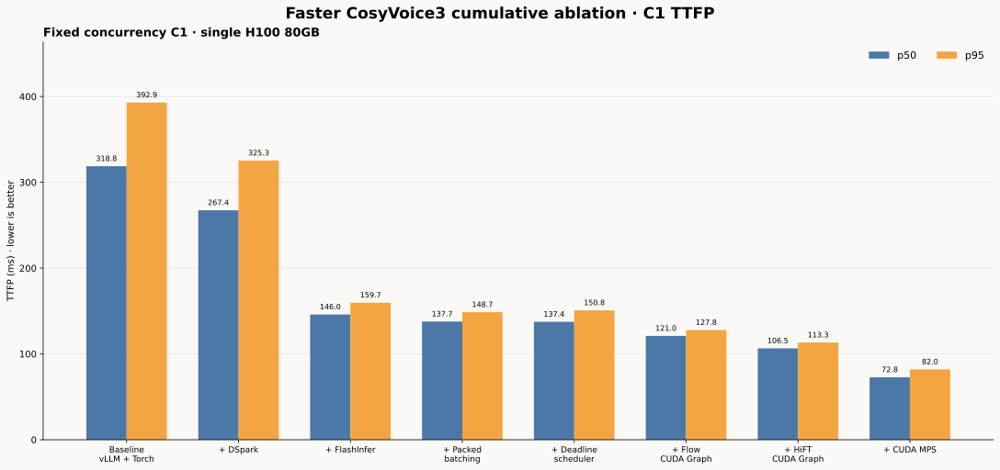
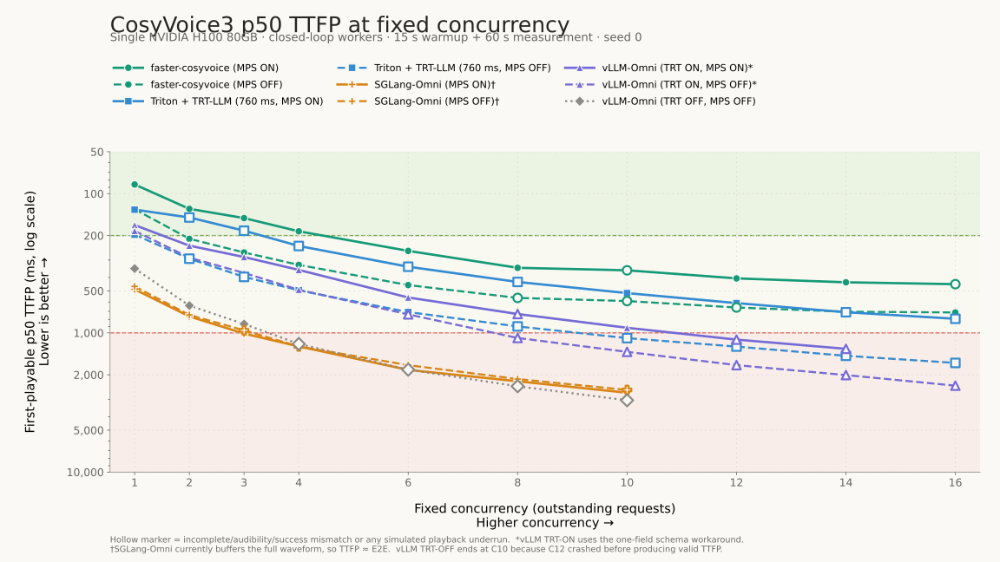
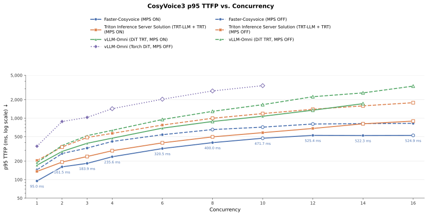
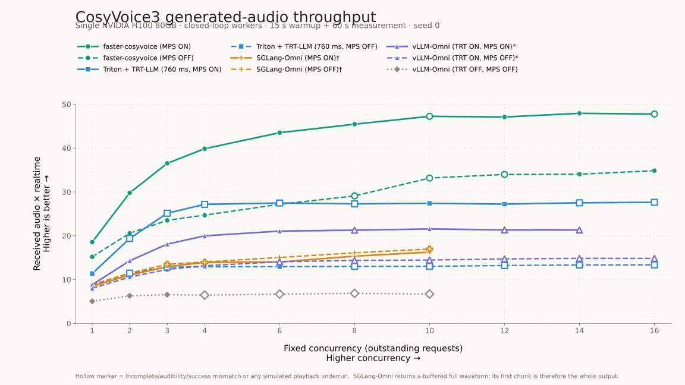

# Faster CosyVoice Benchmark

本文记录 Faster CosyVoice 的性能指标、累积消融结果，以及与其他 CosyVoice3
推理框架的固定并发对比。

## 指标与测试方法

| 指标 | 定义 | 解读 |
|---|---|---|
| TTFP | 从发起请求到客户端收到第一块可播放 PCM 的时间 | 越低越好 |
| p50 TTFP | 所有请求 TTFP 的中位数 | 表示典型请求延迟 |
| p95 TTFP | 95% 请求不超过的 TTFP | 表示尾延迟 |
| RTFx | 测量窗口内收到的音频总时长 / 测量窗口时长 | 越高越好；`1 RTFx` 表示实时生成 |

本文统一使用 **RTFx** 表示音频吞吐。它与单请求常用的 RTF 方向相反：RTF 是计算
时间除以音频时长，越低越好；RTFx 是单位墙钟时间生成的音频时长，越高越好。为兼容
已有结果，图片文件名和原始 CSV 字段仍保留 `audio-xrt` 与
`received_audio_xrt`。

所有测试采用 Nari-compatible client 的 closed-loop fixed-concurrency 负载。固定并发
`C` 表示同时运行 `C` 个 worker；每个 worker 必须等待当前请求完整结束，才会发送下一
条请求。因此，横轴表示持续存在的并发请求数，不等同于 open-loop 测试中的目标 RPS。

除特别说明外，测试协议保持一致：

- 单张 NVIDIA H100 80GB；
- 固定注册音色；
- 使用同一组确定性的 Seed-TTS evaluation text sequence；
- 15 秒 warmup，随后测量 60 秒；
- seed 为 `0`；
- leading-silence trim 关闭；
- percentile 使用 nearest-rank 方法计算。

## Faster CosyVoice 累积消融

消融测试于 2026-09-02 完成，使用固定并发 C1。所有请求均完整返回、没有 underrun，
实测首块音频长度均为 760 ms。A0–A6 关闭 MPS，A7 只在 A6 基础上开启 MPS；每一行
都包含此前步骤的全部优化。

| Step | 累积配置 | TTFP p50 | TTFP p95 |
|---|---|---:|---:|
| A0 | vLLM target-only + Torch Flow | 318.8 ms | 392.9 ms |
| A1 | A0 + DSpark speculative decoding | 267.4 ms | 325.3 ms |
| A2 | A1 + FlashInfer Flow | 146.0 ms | 159.7 ms |
| A3 | A2 + packed batching | 137.7 ms | 148.7 ms |
| A4 | A3 + deadline-aware scheduler | 137.4 ms | 150.8 ms |
| A5 | A4 + Flow CUDA Graph | 121.0 ms | 127.8 ms |
| A6 | A5 + HiFT CUDA Graph | 106.5 ms | 113.3 ms |
| A7 | A6 + CUDA MPS | **72.8 ms** | **82.0 ms** |

从 A0 到 A7，C1 TTFP p50 降低 77.2%，p95 降低 79.1%。这些增量依赖当前加入
顺序和 workload，不能把每项优化的百分比独立相加。Deadline-aware scheduler 在稳定
closed-loop C1 下的收益不明显；它主要用于 bursty 或 open-loop 流量下保护已经开始播放
的 stream，降低尾延迟和 underrun 风险。

## 与其他框架对比

下面使用同一个 Nari-compatible client，在固定并发下比较 Faster CosyVoice、Triton +
TensorRT-LLM、vLLM-Omni 和 SGLang-Omni。横轴均为 outstanding requests，TTFP 越低
越好，RTFx 越高越好。

### TTFP p50

### TTFP p95

### RTFx

Faster CosyVoice、Triton 和 vLLM-Omni 的对比数据将首块音频对齐为 760 ms。图中的
SGLang-Omni 数据来自当时会缓存完整 waveform 的实现，首块约为 4.0–4.3 秒，因此其
TTFP 更接近端到端延迟，不能与 760 ms streaming 首块做完全等价的延迟比较。

空心数据点表示该配置存在请求不完整、audibility/success 数量不一致，或模拟播放发生
underrun。此类数据点的 RTFx 可以用于观察原始吞吐，但不应视为能够稳定连续播放的服务
容量。部分曲线较早结束，是因为更高并发下没有得到有效测试结果。
