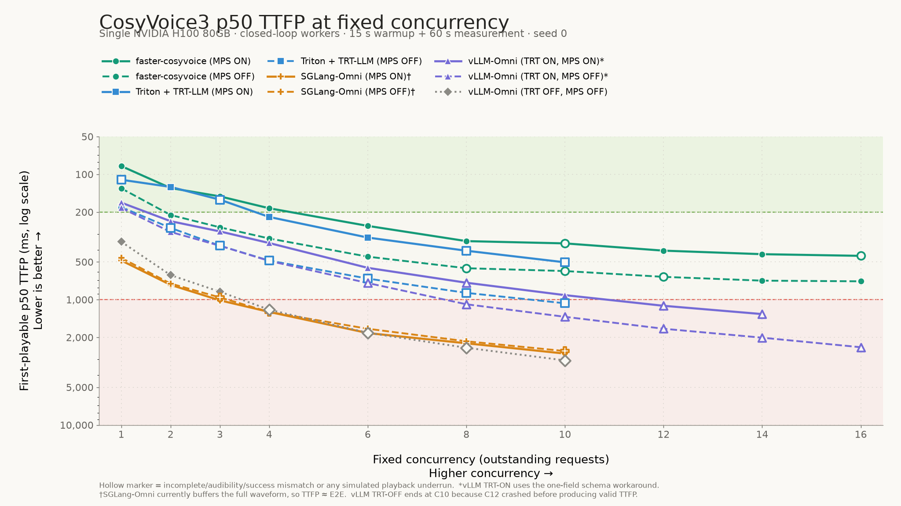
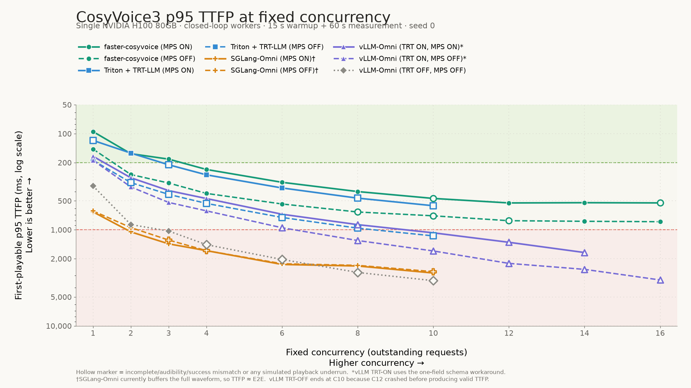

# CosyVoice3 单卡 H100 Nari Benchmark 汇总

本文记录 2026-08-28 在本机完成的系列测试，整理于 2026-08-31，并于 2026-09-01
补充 SGLang-Omni、Triton + TensorRT-LLM，以及 vLLM-Omni exact latest main 的固定
并发和 MPS / TensorRT A/B 数据。可直接横向比较的
后端结果与配置探索结果分开记录，避免把临时补丁、失败或探索性测试误当作上游正式
性能数据。

## 结论摘要

- 在共同测试的 RPS 1、2、4、6 上，`faster-cosyvoice` 的 TTFP 和连续播放表现最好。
  deadline-aware 基础配置在 RPS 8 scout 仍保持连续，容量边界位于 RPS 8–10。
- Triton + TensorRT-LLM 的 LLM 和 token2wav CUDA 进程共用一张 H100 时非常依赖
  CUDA MPS。开启 MPS 后，RPS 3 从 0/199 success、199 个 underrun 变为
  199/199 success、零 underrun。
- 2026-08-31 的 vLLM-Omni `be335a86` 快照在 RPS 1 正常、RPS 2 开始退化，并在
  RPS 3、4 因 `MetaStruct` 缺少 `resumable` 字段而稳定复现 stage 进程退出。仅添加
  `resumable: bool | None = None` 可以避免崩溃，但该批 open-loop 接收音频吞吐仍停在
  约 15x realtime。
- 2026-09-01 重新拉取的 exact upstream `main` 为 `e2b83db6`。其未修改、TensorRT OFF
  基线在固定并发 12 再次触发相同 schema 错误；C1–C10 的吞吐平台仅约 1.4 RPS / 6.9xRT。
- vLLM-Omni 的 `COSYVOICE3_TRT=1` 不是把 AR LLM 换成 TensorRT-LLM，而是用
  TensorRT 10.10 加速 CampPlus speaker embedding 和 flow/code2wav estimator。加单字段
  schema workaround 后，MPS OFF 的平台提高到约 3.1 RPS / 14.9xRT；再开 MPS 100%，
  平台提高到约 4.7 RPS / 21.6xRT，C10 的 TTFP p95 从 1659.744 ms 降到 1074.793 ms。
- SGLang-Omni latest main 已正式支持 CosyVoice3，RPS 1、2、3、4、6 均返回完整 PCM，
  但当前 vocoder 是整段缓冲实现，TTFP 基本等于 E2E。接收音频吞吐同样在约 15xRT
  饱和，容量拐点位于 RPS 3–4；RPS 6 的 TTFP p50/p95 为 37.614/44.319 秒。
- SGLang-Omni 当前三个阶段在同一个 GPU 进程内执行；固定并发 C1–C10 的 MPS ON
  相对 OFF 没有收益。C10 的实际 RPS 从 3.900 降至 3.750，TTFP p95 从
  2724.849 ms 增至 2815.742 ms，符合单 CUDA client 不受益于 MPS 的进程拓扑。
- Triton 固定并发 C1–C10 中 MPS 提升显著。C10 的实际 RPS 从 2.867 提高到
  5.917（2.06 倍），TTFP p50/p95 从 1068.129/1157.521 ms 降到
  503.300/561.692 ms；接收音频平台从约 13.4xRT 提高到约 27.1xRT。
- faster-cosyvoice 的两个 CUDA client 也明显受益于 MPS。MPS OFF 在 C16 为
  7.683 RPS / 34.851xRT，MPS ON 为 10.467 RPS / 47.781xRT；两组 C1–C16 均无
  underrun。MPS ON 在 C14 左右达到约 10.5 RPS 的 closed-loop 吞吐平台。
- 固定并发与 Poisson RPS 不能按横轴数字直接比较。固定并发会等待完整响应并自限速；
  Poisson 会继续按时钟注入请求。faster-cosyvoice 在固定并发 8 时实际发起率为
  9.967 RPS、TTFP p95 400.041 ms，而 Poisson 请求 RPS 10 的实际发起率为
  9.817 RPS、TTFP p95 12.735 秒，差异主要来自 open-loop 的排队放大。

## 测试约定

| 项目 | 值 |
|---|---|
| GPU | 每个后端独占一张 NVIDIA H100 80GB HBM3 |
| 到达模型 | Poisson open-loop；另有 closed-loop fixed-concurrency 对比 |
| 随机种子 | 0 |
| Scout 时长 | warmup 15s + measurement 60s |
| Canonical 时长 | warmup 30s + measurement 300s |
| 请求超时 | 常规测试 120s；2026-09-01 vLLM exact-main fixed sweep 为 300s |
| 最大 in-flight | 4096 |
| 输出 | Raw mono PCM16，24 kHz |
| 语言 | English |
| 音色 | 相同的 `benchmark` reference；SGLang / vLLM 显式传入同一 `ref_audio` / `ref_text` |
| 数据集 | `benchmarks/data/seed-tts-eval.jsonl`，1,088 条 prompt |
| Dataset SHA-256 | `c95cb482f71117cbc46ac4e3aa5eab5c199bb0386d9e5600d912e157da8d2866` |
| Dataset pool SHA-256 | `661013d15bb15db122a947513d9e718fefd6c0d9f3dbd32ec1efebf13f6fecb1` |
| Nari benchmark revision | `a2d65e16fa121d9dbd80dfbb0cf1007563f96509` |
| Nari benchmark package | `0.1.0` |
| WER | 未测试；未配置 Deepgram key |

对于存在对应结果的 RPS 1、2、3、4、6，已经校验 arrival 文件和 measurement prompt
序列逐字节或逐条一致。RPS 3 没有 `faster-cosyvoice` 基础配置结果，Triton MPS OFF
没有 RPS 4 结果。

对于 raw PCM，TTFB 与 first playable 相同，本文统一称为 **TTFP**。Audible TTFA
还包括生成音频开头的静音。`Success` 直接采用 Nari 报告中的
`successful_requests`，`Underrun` 单独列出。除 audible detector 外未检查语义质量，
本系列不能用于得出 WER 结论。

## 后端直接对比

以下为共同的 60 秒 scout 配置，延迟单位均为毫秒。标注 `schema fix` 的 vLLM 行不是
未修改的上游结果。

| 后端 | 请求 RPS（实际） | 请求数 | TTFP p50 / p95 / p99 | Audible p95 | E2E p95 | Success | Underrun | Peak in-flight | 接收音频 |
|---|---:|---:|---:|---:|---:|---:|---:|---:|---:|
| faster-cosyvoice, deadline-aware | 1 (1.117) | 67 | **80.823 / 201.481 / 281.964** | 905.592 | 583.980 | 67/67 | 0/67 | 4 | 5.047xRT |
| faster-cosyvoice, deadline-aware | 2 (2.267) | 136 | **91.082 / 224.039 / 252.755** | 921.124 | 639.602 | 136/136 | 0/136 | 5 | 10.210xRT |
| faster-cosyvoice, deadline-aware | 4 (4.267) | 256 | **151.387 / 298.916 / 365.707** | 976.263 | 884.836 | 256/256 | 0/256 | 9 | 18.979xRT |
| faster-cosyvoice, deadline-aware | 6 (6.350) | 381 | **241.222 / 416.319 / 456.732** | 1023.025 | 1757.285 | 381/381 | 0/381 | 17 | 28.809xRT |
| Triton + TensorRT-LLM, MPS ON | 1 (1.117) | 67 | 118.764 / 232.296 / 482.201 | 1657.075 | 756.739 | 67/67 | 0/67 | 4 | 4.987xRT |
| Triton + TensorRT-LLM, MPS ON | 2 (2.267) | 136 | 121.036 / 243.236 / 329.882 | 1521.388 | 761.453 | 136/136 | 0/136 | 6 | 10.280xRT |
| Triton + TensorRT-LLM, MPS ON | 3 (3.317) | 199 | 138.300 / 303.671 / 358.375 | 1112.315 | 913.326 | 199/199 | 0/199 | 7 | 14.839xRT |
| Triton + TensorRT-LLM, MPS ON | 4 (4.267) | 256 | 180.239 / 471.882 / 592.823 | 1422.663 | 1458.828 | 256/256 | 5/256 | 13 | 19.359xRT |
| Triton + TensorRT-LLM, MPS ON | 6 (6.350) | 381 | 1944.981 / 2407.012 / 2501.309 | 5023.523 | 9246.656 | 0/381 | 381/381 | 56 | 26.937xRT |
| vLLM-Omni main | 1 (1.117) | 67 | 169.295 / 411.713 / 512.051 | 1107.212 | 1410.479 | 67/67 | 0/67 | 5 | 5.009xRT |
| vLLM-Omni main | 2 (2.267) | 136 | 371.989 / 1336.423 / 1488.241 | 2169.846 | 3143.994 | 135/136 | 5/136 | 12 | 11.095xRT |
| vLLM-Omni main + schema fix | 3 (3.317) | 199 | 18449.606 / 24202.110 / 24924.009 | 24635.933 | 28117.238 | 90/199 | 194/199 | 83 | 15.067xRT |
| vLLM-Omni main + schema fix | 4 (4.267) | 256 | 38376.117 / 49644.052 / 51136.380 | 50547.285 | 53075.498 | 106/256 | 246/256 | 154 | 15.240xRT |
| vLLM-Omni main + schema fix | 6 (6.350) | 381 | 77378.682 / 111292.344 / 112866.639 | 111462.344 | 114056.301 | 168/381 | 369/381 | 304 | 15.004xRT |
| SGLang-Omni main（buffered） | 1 (1.117) | 67 | 558.438 / 1077.649 / 1469.171 | 1628.116 | 1078.423 | 67/67 | 0/67 | 4 | 4.795xRT |
| SGLang-Omni main（buffered） | 2 (2.267) | 136 | 854.195 / 1963.710 / 2118.233 | 2308.233 | 1964.243 | 136/136 | 0/136 | 9 | 9.837xRT |
| SGLang-Omni main（buffered） | 3 (3.317) | 199 | 1819.358 / 4564.495 / 5516.335 | 4753.019 | 4566.328 | 199/199 | 0/199 | 20 | 14.639xRT |
| SGLang-Omni main（buffered） | 4 (4.267) | 256 | 11851.487 / 15873.667 / 16328.341 | 16217.710 | 15874.203 | 256/256 | 0/256 | 64 | 15.209xRT |
| SGLang-Omni main（buffered） | 6 (6.350) | 381 | 37614.122 / 44318.510 / 45113.936 | 44683.027 | 44319.246 | 381/381 | 0/381 | 227 | 14.465xRT |

## 两种负载模型：Poisson RPS 与固定并发

固定并发 client 采用与 `client_grpc.py` 相同的 closed-loop 思路：创建 `C` 个 worker，
每个 worker 始终最多保留一个请求，只有完整收到上一条响应后才开始下一条。数据集、
prompt 顺序生成规则、固定音色、采样率、audible detector、warmup 15 秒和 measurement
60 秒均沿用 Nari 测试口径。

| 维度 | Poisson 固定 RPS（open-loop） | 固定并发（closed-loop） |
|---|---|---|
| 控制量 | 请求到达率 RPS | 同时 outstanding 的请求数 `C` |
| 下一请求何时发出 | 由独立 Poisson 时钟决定，不等待旧请求 | worker 收完上一条完整响应后 |
| 排队上限 | 可持续增长，受 `max_in_flight` 限制 | client 侧严格不超过 `C` |
| `actual_rps` 含义 | 实际发起率，主要反映 arrival schedule | 实际发起率，受服务完成速度反压 |
| 饱和后的典型表现 | 队列、TTFP 和尾延迟迅速增长，可能 drop/timeout | 发起率趋于平台，增加 `C` 主要增加等待延迟 |
| 最适合回答的问题 | “给定外部流量时能否扛住、何处过载？” | “N 个持续用户同时请求时体验如何？” |

所以不能比较“并发 3”和“RPS 3”这两个数字；应至少同时看实际发起率、TTFP、完整
PCM、audible、underrun 和接收音频 xRT。固定并发会把服务端完成速度反馈到下一次
发起时间，因此它不会复现 open-loop 在超容量流量下的无限排队。

### 2026-09-01 当前容器补测

以下新增结果全部使用同一张独占 H100、相同 fixed-concurrency client、seed 0、15 秒
warmup + 60 秒 measurement，以及同一个固定 reference WAV。每个 worker 始终最多有
一条在途请求。表中 `PCM / Audible / Success` 分别表示完整 PCM、检测到可听起点和
满足 Nari 连续播放成功标准的请求数。最初的 sweep 使用严格 audible gate；为了补齐
容量曲线，本轮续测设置 `STOP_ON_INVALID_AUDIO=0`，记录异常但不因近静音输出停止。

#### Fixed-concurrency TTFP 曲线

横轴是 configured fixed concurrency，而不是实际 RPS；纵轴采用与 Nari 图一致的反向
log scale，越靠上表示延迟越低。实线为 MPS ON，虚线为 MPS OFF；空心 marker 表示
该点存在 PCM/audible/success 数量不一致或模拟播放 underrun。vLLM TRT-ON 两条曲线
带单字段 schema workaround，未修改的 TRT-OFF 曲线在 C12 crash，因此只画到 C10。





两张图的 74 个有效点另存为
[CSV](assets/cosyvoice3-fixed-concurrency-data.csv)，SVG 版本与 PNG 同目录。复现命令：

```bash
python3 scripts/plot_fixed_concurrency_benchmark.py
```

#### Triton + TensorRT-LLM：MPS OFF / ON

被测 CosyVoice revision 为 `ee734e0d24f371e107ed37bec112997e9557475d`，Triton
Server 2.59.0、TensorRT-LLM 0.20.0、BF16 LLM engine、BLS instance count 10。
MPS ON 使用 active-thread percentage 100。

| MPS | 并发 | 实际 RPS | 请求数 | TTFP p50 / p95 / p99 | Audible p50 / p95 / p99 | E2E p50 / p95 / p99 | PCM / Audible / Success | Underrun | 接收音频 |
|---|---:|---:|---:|---:|---:|---:|---:|---:|---:|
| OFF | 1 | 1.917 | 115 | 182.733 / 189.143 / 190.887 | 573.727 / 1359.066 / 2482.144 | 518.055 / 692.478 / 869.085 | 115/115/115 | 0/115 | 8.471xRT |
| OFF | 2 | 2.483 | 149 | 267.529 / 322.934 / 350.148 | 666.329 / 1239.808 / 1978.063 | 789.227 / 1084.548 / 1383.662 | 149/148/149 | 1/149 | 11.487xRT |
| OFF | 3 | 2.733 | 164 | 370.801 / 427.789 / 466.506 | 725.585 / 1828.975 / 2561.112 | 1082.261 / 1303.312 / 1865.160 | 164/164/164 | 1/164 | 12.623xRT |
| OFF | 4 | 2.883 | 173 | 487.574 / 531.378 / 553.523 | 832.768 / 1607.820 / 2205.439 | 1417.861 / 1703.174 / 1905.526 | 173/173/173 | 1/173 | 13.147xRT |
| OFF | 6 | 2.900 | 174 | 678.707 / 743.806 / 757.404 | 977.077 / 2320.654 / 3639.647 | 2117.763 / 2395.778 / 2482.729 | 174/174/174 | 153/174 | 13.204xRT |
| OFF | 8 | 2.933 | 176 | 882.150 / 960.947 / 1032.076 | 1197.208 / 2294.816 / 3538.426 | 2812.515 / 3199.223 / 3891.689 | 176/176/176 | 169/176 | 13.363xRT |
| OFF | 10 | 2.867 | 172 | 1068.129 / 1157.521 / 1185.686 | 1446.399 / 2913.044 / 4900.020 | 3658.207 / 3988.941 / 4702.933 | 172/172/106 | 171/172 | 12.911xRT |
| ON | 1 | 2.517 | 151 | **110.418 / 117.497 / 120.093** | 361.917 / 1498.198 / 3009.944 | 368.629 / 565.205 / 1054.821 | 151/150/151 | 0/151 | **11.472xRT** |
| ON | 2 | 4.317 | 259 | 125.991 / 159.158 / 184.419 | 507.934 / 1464.732 / 2406.233 | 458.478 / 629.669 / 871.202 | 259/259/259 | 0/259 | 19.461xRT |
| ON | 3 | 5.433 | 326 | 159.228 / 210.589 / 236.597 | 509.232 / 1324.530 / 2843.948 | 553.837 / 733.065 / 858.400 | 326/325/326 | 1/326 | 25.190xRT |
| ON | 4 | 5.883 | 353 | 218.765 / 268.043 / 284.055 | 565.944 / 1620.254 / 2707.447 | 695.909 / 858.679 / 1128.173 | 353/353/353 | 0/353 | 27.061xRT |
| ON | 6 | 6.017 | 361 | 319.375 / 366.983 / 384.800 | 670.100 / 1415.050 / 2437.924 | 1052.370 / 1146.530 / 1326.327 | 361/361/361 | 0/361 | 26.699xRT |
| ON | 8 | 5.967 | 358 | 406.752 / 468.412 / 487.892 | 761.562 / 1450.262 / 2875.890 | 1413.929 / 1529.248 / 1830.874 | 358/358/358 | 1/358 | 27.126xRT |
| ON | 10 | 5.917 | 355 | 503.300 / 561.692 / 584.420 | 858.785 / 1986.657 / 2743.478 | 1776.739 / 1899.327 / 2311.040 | 355/355/355 | 129/355 | 27.083xRT |

共同 C1–C10 上，MPS ON 的实际 RPS 均高于 OFF。C10 提高 2.06 倍，TTFP p50/p95
分别降低 52.9%/51.5%，接收音频提高 2.10 倍。MPS OFF 在 C4 后吞吐停在约
2.9 RPS / 13.3xRT；MPS ON 在 C4 后停在约 6.0 RPS / 27.1xRT。C6 以后两组的
underrun 都会增加，但这是模拟实时播放连续性指标，不代表 PCM 缺失；所有行仍返回
完整 PCM。早期检测到的近静音请求仍保留在计数中，本轮没有因此提前停止。

#### SGLang-Omni：MPS OFF / ON

被测 revision 为 `7bbdac6eef10ebc308cee36dd1f9b2b1b68084cb`，SGLang
0.5.18、PyTorch 2.13.0+cu130。当前 `preprocessing -> tts_engine -> vocoder` 三阶段
由同一个 GPU 进程承载，MPS ON 同样使用 active-thread percentage 100。

| MPS | 并发 | 实际 RPS | 请求数 | TTFP p50 / p95 / p99 | Audible p50 / p95 / p99 | E2E p50 / p95 / p99 | PCM / Audible / Success | Underrun | 接收音频 |
|---|---:|---:|---:|---:|---:|---:|---:|---:|---:|
| OFF | 1 | 2.050 | 123 | 464.293 / 635.755 / 744.619 | 754.988 / 1125.938 / 1366.402 | 465.850 / 636.842 / 745.230 | 123/123/123 | 0/123 | 8.859xRT |
| ON | 1 | 1.967 | 118 | 486.724 / 650.533 / 754.834 | 801.095 / 1240.818 / 1669.175 | 487.216 / 652.779 / 755.776 | 118/118/118 | 0/118 | 8.478xRT |
| OFF | 2 | 2.667 | 160 | 743.397 / 948.047 / 1180.861 | 1040.186 / 1576.361 / 2072.714 | 744.853 / 949.726 / 1181.637 | 160/160/160 | 0/160 | 11.487xRT |
| ON | 2 | 2.567 | 154 | 761.762 / 1050.985 / 1200.508 | 1080.011 / 1518.091 / 1793.829 | 762.352 / 1051.464 / 1201.440 | 154/154/154 | 0/154 | 11.029xRT |
| OFF | 3 | 3.067 | 184 | 959.265 / 1277.941 / 1539.315 | 1228.707 / 1841.904 / 2719.947 | 960.488 / 1278.510 / 1540.039 | 184/183/184 | 0/184 | 13.487xRT |
| ON | 3 | 2.950 | 177 | 1012.093 / 1399.686 / 1637.437 | 1286.184 / 1947.437 / 2223.194 | 1012.792 / 1400.382 / 1638.183 | 177/177/177 | 0/177 | 12.933xRT |
| OFF | 4 | 3.167 | 190 | 1252.626 / 1646.497 / 1992.741 | 1533.483 / 2120.657 / 3211.965 | 1253.602 / 1647.252 / 1995.874 | 190/190/190 | 0/190 | 14.035xRT |
| ON | 4 | 3.133 | 188 | 1251.677 / 1647.333 / 2408.793 | 1556.593 / 2274.480 / 3166.691 | 1252.317 / 1648.193 / 2421.715 | 188/186/188 | 0/188 | 13.936xRT |
| OFF | 6 | 3.450 | 207 | 1705.797 / 2253.329 / 2411.055 | 1977.315 / 2803.329 / 3493.883 | 1706.348 / 2254.440 / 2411.707 | 207/207/207 | 0/207 | 15.045xRT |
| ON | 6 | 3.233 | 194 | 1845.695 / 2293.845 / 2483.068 | 2151.019 / 2689.009 / 2992.832 | 1846.213 / 2295.692 / 2483.609 | 194/194/194 | 0/194 | 14.015xRT |
| OFF | 8 | 3.700 | 222 | 2146.428 / 2343.130 / 2917.722 | 2438.274 / 2995.156 / 4034.928 | 2147.213 / 2345.342 / 2919.462 | 222/222/222 | 0/222 | 16.111xRT |
| ON | 8 | 3.567 | 214 | 2227.340 / 2378.779 / 2928.420 | 2500.947 / 3039.001 / 3707.247 | 2227.761 / 2379.487 / 2929.211 | 214/214/214 | 0/214 | 15.350xRT |
| OFF | 10 | 3.900 | 234 | 2569.233 / 2724.849 / 2791.898 | 2875.472 / 3279.454 / 3701.316 | 2570.014 / 2725.391 / 2793.874 | 234/233/234 | 0/234 | 16.967xRT |
| ON | 10 | 3.750 | 225 | 2691.662 / 2815.742 / 2857.277 | 2924.991 / 3357.391 / 3653.994 | 2692.127 / 2816.144 / 2858.344 | 225/225/225 | 0/225 | 16.267xRT |

共同 C1–C10 的每个点上，MPS ON 的实际 RPS 都比 OFF 低 1.1%–6.3%；C10 低
3.8%，TTFP p95 高 3.3%。没有观察到加速。原因与进程拓扑一致：MPS 擅长让多个
CUDA 进程/contexts 交叠，而当前 SGLang 的三个阶段只形成一个 GPU client。C3 OFF、
C4 ON 和 C10 OFF 各有少量未越过 audible detector 门限的完整 PCM；本轮按要求继续
跑完 C10，因此这些音频只影响 Audible 列，不影响曲线完整性。

#### vLLM-Omni exact latest main：TensorRT / MPS A/B

| 组件 | Revision/version |
|---|---|
| vLLM-Omni | `e2b83db683673a0d54bb58db5f12d27a7f9f20e0` (`0.28.1.dev5+ge2b83db68`) |
| vLLM | `0.28.0` |
| PyTorch / CUDA wheel | `2.13.0+cu130` |
| TensorRT | `10.10.0.31` |
| Model | `FunAudioLLM/Fun-CosyVoice3-0.5B-2512` |

该 commit 是测试时 `git ls-remote` 验证到的 exact upstream `main`，使用独立的临时
clone/venv，没有切换或修改用户的 `../vllm-omni` worktree。`COSYVOICE3_TRT=1`
成功加载两个 plan，并由服务日志同时确认：

```text
CosyVoice3: using TensorRT campplus speaker embedding
CosyVoice3: using TensorRT flow-decoder estimator (code2wav)
```

这里的 TensorRT 边界仅为 CampPlus 和 flow estimator；stage 0 的 AR LLM 仍由 vLLM
执行，并不是 TensorRT-LLM。首次冷启动构建的 plan 分别约 32 MB 和 666 MB；正式
采样在 plan 构建完成并经过真实请求预热后开始。

未修改 latest main、`COSYVOICE3_TRT=0`、MPS OFF 的基线如下。C12 的高
`actual_rps` 是请求快速失败造成的假象，不是吞吐提升。

| 并发 | 实际 RPS | 请求数 | TTFP p50 / p95 / p99 | Audible p50 / p95 / p99 | E2E p50 / p95 / p99 | PCM / Audible / Success | Underrun | 接收音频 |
|---:|---:|---:|---:|---:|---:|---:|---:|---:|
| 1 | 1.100 | 66 | 345.110 / 349.618 / 349.977 | 715.696 / 1745.012 / 3263.897 | 813.608 / 1126.590 / 1344.186 | 66/66/66 | 0/66 | 5.049xRT |
| 2 | 1.317 | 79 | 636.723 / 882.283 / 888.308 | 1124.183 / 2435.577 / 2517.080 | 1607.772 / 1857.540 / 2092.912 | 79/79/79 | 0/79 | 6.308xRT |
| 3 | 1.383 | 83 | 863.567 / 1029.548 / 1089.424 | 1274.148 / 2442.992 / 3752.456 | 2035.286 / 2523.988 / 3185.501 | 83/83/83 | 0/83 | 6.553xRT |
| 4 | 1.367 | 82 | 1201.440 / 1427.195 / 1737.445 | 1588.496 / 2412.210 / 4336.653 | 2780.479 / 3282.102 / 3887.932 | 82/82/82 | 33/82 | 6.443xRT |
| 6 | 1.417 | 85 | 1837.321 / 2035.864 / 2152.219 | 2199.389 / 3847.722 / 5501.961 | 3959.668 / 4850.649 / 5916.240 | 85/85/85 | 78/85 | 6.681xRT |
| 8 | 1.400 | 84 | 2417.698 / 2776.556 / 3102.897 | 2885.007 / 4719.872 / 7928.524 | 5647.295 / 6499.038 / 9006.869 | 84/84/31 | 82/84 | 6.855xRT |
| 10 | 1.383 | 83 | 3050.431 / 3382.558 / 3544.451 | 3528.543 / 5250.480 / 6066.974 | 7428.088 / 8066.905 / 9433.990 | 83/83/6 | 83/83 | 6.705xRT |
| 12 | 17.050 | 1023 | - | - | 703.035 / 766.086 / 819.974 | 0/0/0 | 0/1023 | 0.000xRT |

C12 时 stage 1 因下列错误退出，health 变为 503；这不是 OOM 或 hard concurrency
限制，后续 C14/C16 没有运行：

```text
msgspec.ValidationError: Object contains unknown field 'resumable' - at '$.meta'
```

为完成 TensorRT 与 MPS 测试，只在隔离的 `/tmp` clone 中给 `MetaStruct` 增加一行
`resumable: bool | None = None`。它不改变模型、scheduler 或 TensorRT engine；下列
所有行都明确标为 schema workaround。由于 TensorRT OFF 基线保持原版、TensorRT ON
带这一行，二者不是严格 clean-tree A/B；但共同的 C1–C10 尚未触发该字段错误，该行不
参与数值计算。

TensorRT ON、MPS OFF：

| 并发 | 实际 RPS | 请求数 | TTFP p50 / p95 / p99 | Audible p50 / p95 / p99 | E2E p50 / p95 / p99 | PCM / Audible / Success | Underrun | 接收音频 |
|---:|---:|---:|---:|---:|---:|---:|---:|---:|
| 1 | 1.733 | 104 | 185.273 / 189.394 / 192.712 | 523.504 / 1649.335 / 2287.909 | 523.053 / 778.435 / 999.788 | 104/104/104 | 0/104 | 8.006xRT |
| 2 | 2.317 | 139 | 288.198 / 358.057 / 376.843 | 627.347 / 1467.476 / 2176.203 | 781.789 / 1322.386 / 1524.311 | 139/139/139 | 0/139 | 10.562xRT |
| 3 | 2.650 | 159 | 371.200 / 519.046 / 567.051 | 757.451 / 1770.960 / 2932.134 | 1075.966 / 1755.181 / 2014.425 | 159/159/159 | 0/159 | 12.320xRT |
| 4 | 2.950 | 177 | 490.533 / 635.309 / 701.805 | 886.473 / 1665.326 / 2543.870 | 1306.866 / 1881.371 / 2241.768 | 177/177/177 | 0/177 | 13.167xRT |
| 6 | 3.083 | 185 | 736.360 / 951.909 / 1064.488 | 1065.201 / 2034.062 / 3835.615 | 1828.360 / 2639.808 / 3293.015 | 185/185/185 | 5/185 | 14.061xRT |
| 8 | 3.083 | 185 | 1087.884 / 1292.435 / 1308.514 | 1478.311 / 2421.237 / 4374.945 | 2459.401 / 3233.083 / 4658.150 | 185/185/185 | 3/185 | 14.377xRT |
| 10 | 3.017 | 181 | 1369.235 / 1659.744 / 1806.546 | 1760.194 / 2898.514 / 3792.174 | 3248.855 / 4410.991 / 4768.088 | 181/181/181 | 62/181 | 14.465xRT |
| 12 | 2.967 | 178 | 1704.992 / 2235.282 / 2550.585 | 2110.197 / 3482.602 / 4060.193 | 3621.924 / 5449.330 / 7619.854 | 178/178/176 | 126/178 | 14.706xRT |
| 14 | 2.900 | 174 | 2009.422 / 2579.835 / 3176.954 | 2431.451 / 3627.544 / 4933.265 | 4833.579 / 6554.972 / 7674.021 | 174/174/164 | 162/174 | 14.851xRT |
| 16 | 2.867 | 172 | 2394.706 / 3325.770 / 3873.071 | 2847.580 / 4657.409 / 5721.997 | 5177.636 / 8033.342 / 9644.122 | 172/172/127 | 170/172 | 14.847xRT |

在尚未触发 schema bug 的共同 C1–C10 上，TensorRT ON 相对 OFF 均显著加速。C1 的
实际 RPS 从 1.100 提高到 1.733（+57.6%），TTFP p50/p95 分别降低 46.3%/45.8%；
C10 的实际 RPS 从 1.383 提高到 3.017（+118.1%），TTFP p50/p95 分别降低
55.1%/50.9%。接收音频平台也从约 6.9xRT 提高到约 14.9xRT。该比例仍须连同上面的
schema-only source 差异一起披露。

TensorRT ON、MPS ON（active-thread percentage 100）：

| 并发 | 实际 RPS | 请求数 | TTFP p50 / p95 / p99 | Audible p50 / p95 / p99 | E2E p50 / p95 / p99 | PCM / Audible / Success | Underrun | 接收音频 |
|---:|---:|---:|---:|---:|---:|---:|---:|---:|
| 1 | 1.917 | 115 | 168.197 / 171.982 / 173.634 | 580.355 / 1648.866 / 2010.852 | 492.209 / 707.800 / 870.840 | 115/115/115 | 0/115 | 8.837xRT |
| 2 | 3.100 | 186 | 236.428 / 287.444 / 329.679 | 579.788 / 1707.703 / 2567.062 | 602.829 / 844.666 / 1287.999 | 186/186/186 | 0/186 | 14.299xRT |
| 3 | 4.000 | 240 | 285.334 / 390.776 / 432.306 | 677.045 / 1550.037 / 2911.005 | 721.848 / 1026.188 / 1228.409 | 240/240/240 | 0/240 | 18.083xRT |
| 4 | 4.317 | 259 | 353.148 / 472.809 / 570.276 | 739.397 / 2172.548 / 2929.012 | 934.155 / 1232.105 / 1528.539 | 259/259/259 | 0/259 | 19.982xRT |
| 6 | 4.633 | 278 | 557.295 / 688.713 / 743.892 | 906.639 / 1773.739 / 2518.379 | 1261.687 / 1608.786 / 1755.876 | 278/278/278 | 0/278 | 21.073xRT |
| 8 | 4.567 | 274 | 732.283 / 883.699 / 972.637 | 1106.249 / 2123.219 / 3124.133 | 1745.501 / 2154.478 / 2447.649 | 274/274/274 | 1/274 | 21.275xRT |
| 10 | 4.717 | 283 | 919.722 / 1074.793 / 1122.014 | 1319.726 / 2281.474 / 3044.615 | 1993.362 / 2596.852 / 2967.546 | 283/283/283 | 0/283 | 21.563xRT |
| 12 | 4.617 | 277 | 1118.475 / 1348.846 / 1437.099 | 1453.406 / 2609.411 / 3591.583 | 2468.927 / 3183.720 / 3713.499 | 277/277/277 | 5/277 | 21.325xRT |
| 14 | 4.583 | 275 | 1302.586 / 1724.053 / 1932.761 | 1726.191 / 2789.431 / 4106.366 | 3019.865 / 3982.736 / 4254.559 | 275/274/275 | 74/275 | 21.311xRT |

MPS daemon 日志确认 API server、stage 0 和 stage 1 三个 CUDA client 都接入同一个
MPS server，并非只设置了环境变量。共同 C1–C14 上，MPS 将实际 RPS 提高约
10.6%–58.0%；C10 从 3.017 提高到 4.717 RPS，TTFP p50/p95 分别降低
32.8%/35.2%，接收音频从 14.465xRT 提高到 21.563xRT。C14 的请求
`9b30dde30f3745058ec4973e560573a7` 返回 7.20 秒完整 PCM，但 peak -40.18 dBFS、
RMS -62.88 dBFS，未达到 audible detector 门限，因此没有继续 C16。

### 固定并发结果：faster-cosyvoice，MPS OFF / ON

被测 revision 为 `ed7cb7d290526fd4a6770722198f9efaf353a48a`，使用 vLLM
DSpark draft model、7 speculative tokens、async scheduling 和默认 deadline-aware
多进程流水线。MPS ON 使用 active-thread percentage 100，API/flow 进程与 vLLM
engine 两个 CUDA client 均经控制端查询确认接入同一个 MPS server。

| MPS | 并发 | 实际 RPS | 请求数 | TTFP p50 / p95 / p99 | Audible p50 / p95 / p99 | E2E p50 / p95 / p99 | PCM / Audible / Success | Underrun | 接收音频 |
|---|---:|---:|---:|---:|---:|---:|---:|---:|---:|
| OFF | 1 | 3.433 | 206 | 129.322 / 144.496 / 157.264 | 340.253 / 854.183 / 1788.574 | 265.589 / 391.060 / 505.200 | 206/206/206 | 0/206 | 15.200xRT |
| ON | 1 | 4.200 | 252 | 85.918 / 95.045 / 99.360 | 279.731 / 840.625 / 1733.710 | 236.677 / 312.015 / 403.570 | 252/252/252 | 0/252 | 18.562xRT |
| OFF | 2 | 4.600 | 276 | 211.056 / 265.996 / 295.838 | 416.588 / 977.032 / 1234.193 | 406.817 / 593.667 / 680.529 | 276/276/276 | 0/276 | 20.579xRT |
| ON | 2 | 6.650 | 399 | 128.608 / 161.458 / 182.291 | 316.861 / 848.976 / 1280.872 | 271.469 / 393.416 / 479.043 | 399/399/399 | 0/399 | 29.789xRT |
| OFF | 3 | 5.283 | 317 | 264.526 / 326.044 / 346.539 | 470.491 / 1023.002 / 1353.302 | 553.506 / 746.667 / 831.891 | 317/317/317 | 0/317 | 23.521xRT |
| ON | 3 | 8.017 | 481 | 149.836 / 183.907 / 208.214 | 342.841 / 882.367 / 1807.037 | 350.838 / 485.825 / 580.638 | 481/481/481 | 0/481 | 36.525xRT |
| OFF | 4 | 5.567 | 334 | 324.763 / 418.212 / 455.054 | 533.197 / 1108.104 / 1443.470 | 691.104 / 947.115 / 1050.133 | 334/334/334 | 0/334 | 24.703xRT |
| ON | 4 | 8.733 | 524 | 186.442 / 235.631 / 267.885 | 381.666 / 941.119 / 1369.317 | 430.818 / 567.078 / 682.262 | 524/524/524 | 0/524 | 39.874xRT |
| OFF | 6 | 6.033 | 362 | 453.569 / 538.708 / 584.110 | 641.072 / 1190.870 / 1610.245 | 964.628 / 1301.272 / 1540.984 | 362/362/362 | 0/362 | 27.187xRT |
| ON | 6 | 9.517 | 571 | 257.746 / 320.535 / 351.359 | 456.919 / 991.518 / 2029.077 | 604.175 / 802.550 / 901.973 | 571/571/571 | 0/571 | 43.525xRT |
| OFF | 8 | 6.433 | 386 | 560.927 / 652.619 / 711.724 | 766.036 / 1305.387 / 2274.581 | 1207.074 / 1580.403 / 1783.819 | 386/385/386 | 0/386 | 29.096xRT |
| ON | 8 | 9.967 | 598 | 340.928 / 400.041 / 445.076 | 545.540 / 1097.961 / 2184.629 | 775.052 / 974.390 / 1150.599 | 598/598/598 | 0/598 | 45.463xRT |
| OFF | 10 | 7.317 | 439 | 590.727 / 715.126 / 781.769 | 794.022 / 1290.150 / 1723.468 | 1329.595 / 1937.512 / 2187.053 | 439/438/439 | 0/439 | 33.165xRT |
| ON | 10 | 10.317 | 619 | 355.456 / 471.652 / 816.501 | 567.742 / 1159.922 / 1716.501 | 957.280 / 1333.079 / 1581.653 | 619/618/619 | 0/619 | 47.257xRT |
| OFF | 12 | 7.517 | 451 | 657.282 / 803.935 / 848.114 | 883.222 / 1395.511 / 2247.876 | 1530.979 / 2318.384 / 3092.993 | 451/450/451 | 0/451 | 33.995xRT |
| ON | 12 | 10.117 | 607 | 406.152 / 525.360 / 557.371 | 633.098 / 1208.726 / 1765.690 | 1103.495 / 1622.705 / 2130.258 | 607/607/607 | 0/607 | 47.107xRT |
| OFF | 14 | 7.583 | 455 | 704.780 / 815.523 / 971.901 | 908.628 / 1487.022 / 1760.183 | 1678.180 / 2971.692 / 5266.398 | 455/455/455 | 0/455 | 34.046xRT |
| ON | 14 | 10.517 | 631 | 433.334 / 522.347 / 557.936 | 646.742 / 1197.380 / 1479.649 | 1265.933 / 2210.969 / 3166.702 | 631/631/631 | 0/631 | 47.938xRT |
| OFF | 16 | 7.683 | 461 | 713.420 / 823.702 / 874.180 | 912.311 / 1466.049 / 1734.852 | 1720.690 / 3692.587 / 5505.672 | 461/461/461 | 0/461 | 34.851xRT |
| ON | 16 | 10.467 | 628 | 446.903 / 524.894 / 550.116 | 656.431 / 1233.036 / 1622.154 | 1306.168 / 2627.787 / 4222.682 | 628/627/628 | 0/628 | 47.781xRT |

MPS ON 在所有共同并发点上都提高吞吐并降低 TTFP。C10 的实际 RPS 提高 41.0%，
TTFP p50/p95 分别降低 39.8%/34.0%；C16 的实际 RPS 提高 36.2%，TTFP p50/p95
分别降低 37.3%/36.3%。OFF 大约在 7.7 RPS / 34.9xRT 平台化，ON 大约在
10.5 RPS / 47.9xRT 平台化。继续把并发从 14 提到 16 没有增加吞吐，只抬高 E2E
尾延迟。

MPS ON 的 C10 在本次新容器中另做了一次独立复验：9.733 RPS，TTFP p50/p95
387.833/508.432 ms，584/584 success。相对原 C10 的吞吐低 5.7%，因此主表保留同一
批次的原始 C10，复验目录单独留存，不混合替换。

C12 已保存所有音频：MPS OFF 为 451 条 measurement WAV（约 95 MiB），MPS ON 为
607 条（约 129 MiB）。代表样本、文本与逐请求指标见
[MPS OFF 试听索引](../benchmarks/results/fixed-faster-cosyvoice-mps-off-concurrency-12-seed-0/LISTEN.md)
和 [MPS ON 试听索引](../benchmarks/results/fixed-faster-cosyvoice-mps-concurrency-12-seed-0/LISTEN.md)。
OFF 的唯一 audible 异常仍是 `Construction requires study and observation.`，但它是
完整 4.8 秒 PCM，且没有 underrun；ON 的 607 条均检测到可听起点。

### 固定并发结果：vLLM-Omni，TensorRT OFF / MPS OFF

这组结果为 `be335a86`、vLLM 0.28.0、PyTorch 2.13.0+cu130，并带单字段
`resumable` schema workaround。它与旧 Poisson 表中的 cu129 原版 RPS 1、2 并非
完全相同的软件栈，适合比较负载曲线形态，不应用于发布精确版本间加速比例。

| 并发 | 实际 RPS | 请求数 | TTFP p50 / p95 / p99 | Audible p50 / p95 / p99 | E2E p50 / p95 / p99 | PCM / Audible / Success | Underrun | 接收音频 |
|---:|---:|---:|---:|---:|---:|---:|---:|---:|
| 1 | 1.267 | 76 | 264.329 / 268.262 / 271.149 | 623.288 / 1725.011 / 2344.089 | 748.933 / 998.127 / 1216.327 | 76/76/76 | 0/76 | 5.869xRT |
| 2 | 1.500 | 90 | 549.128 / 648.630 / 785.237 | 992.450 / 2482.425 / 3187.970 | 1320.091 / 1685.408 / 1841.498 | 90/90/90 | 0/90 | 7.087xRT |
| 3 | 1.617 | 97 | 846.934 / 920.202 / 972.318 | 1153.866 / 2378.580 / 3778.959 | 1849.717 / 2205.704 / 2663.741 | 97/97/97 | 0/97 | 7.332xRT |
| 4 | 1.633 | 98 | 1064.604 / 1229.305 / 1254.298 | 1387.957 / 2648.494 / 7370.147 | 2298.319 / 2902.607 / 4082.654 | 98/98/98 | 0/98 | 7.509xRT |
| 6 | 1.633 | 98 | 1574.110 / 1778.543 / 1855.674 | 1949.856 / 3106.990 / 3896.135 | 3830.699 / 4380.874 / 5273.304 | 98/98/96 | 66/98 | 7.461xRT |
| 8 | 1.650 | 99 | 2054.718 / 2434.482 / 2484.707 | 2521.163 / 4052.410 / 5651.482 | 4846.829 / 5968.159 / 6792.264 | 99/99/75 | 91/99 | 7.504xRT |
| 10 | 1.667 | 100 | 2571.941 / 2991.857 / 3047.117 | 2926.911 / 4306.055 / 4635.027 | 5704.587 / 7150.967 / 8721.650 | 100/100/18 | 100/100 | 7.758xRT |
| 12 | 1.650 | 99 | 3089.646 / 3750.045 / 3925.728 | 3622.285 / 5572.752 / 6036.131 | 7200.984 / 8463.937 / 9498.531 | 99/99/4 | 99/99 | 7.683xRT |
| 14 | 1.700 | 102 | 3714.955 / 4669.586 / 4785.778 | 4140.894 / 6393.673 / 7583.433 | 8114.494 / 10128.101 / 10997.653 | 102/102/0 | 102/102 | 7.696xRT |
| 16 | 1.617 | 97 | 4369.907 / 5788.162 / 6662.495 | 4986.424 / 7738.636 / 8814.393 | 9215.440 / 11741.565 / 12101.154 | 97/97/3 | 97/97 | 7.408xRT |

实际发起率从并发 3 起基本停在 1.6–1.7 RPS，接收音频也停在约 7.5xRT。继续增加
并发没有提高吞吐，只使 TTFP 近似线性增长，并从并发 6 起出现大面积模拟播放
underrun。这是 closed-loop 下很清楚的服务容量平台。

### 固定并发结果：SGLang-Omni

MPS OFF / ON 的 C1–C10 完整表已合并到上面的“2026-09-01 当前容器补测”小节。
旧批次在 C3/C4 检出的近静音 PCM 仍保留在原始产物中；续测关闭停止门限后已补齐
C4、C6、C8、C10。服务测试结束后已停止，端口 18080 和 GPU 均已释放。

### 近似实际发起率下的直接比较

以下选取实际发起率最接近的点。它不是严格 A/B：两种 arrival 形态不同，fixed 行的
请求数也由响应速度决定；但可以直观看到有界 outstanding 与持续外部注入的差别。

| 后端 / 工作点 | Poisson：实际 RPS，TTFP p50 / p95 | Fixed：并发，实际 RPS，TTFP p50 / p95 | Poisson / Fixed 延迟倍数 |
|---|---:|---:|---:|
| faster-cosyvoice，约 6–7 RPS | 6.350，241.222 / 416.319 | C2，6.650，128.608 / 161.458 | 1.88x / 2.58x |
| faster-cosyvoice，约 8–9 RPS | 8.200，334.652 / 452.092 | C4，8.733，186.442 / 235.631 | 1.79x / 1.92x |
| faster-cosyvoice，约 10 RPS | 9.817，7738.896 / 12735.497 | C8，9.967，340.928 / 400.041 | 22.70x / 31.84x |
| SGLang-Omni，约 2 RPS | 2.267，854.195 / 1963.710 | C1，2.050，464.293 / 635.755 | 1.84x / 3.09x |
| SGLang-Omni，约 3 RPS | 3.317，1819.358 / 4564.495 | C3，3.067，959.265 / 1277.941 | 1.90x / 3.57x |

最明显的是 faster-cosyvoice 约 10 RPS：两边实际发起率只差 1.5%，但 open-loop 已
超过可持续边界，旧请求持续排队，所以 TTFP p95 比固定并发高 31.84 倍。固定并发并不
代表它能在任意时间到达的 10 RPS 外部流量下仍维持 400 ms；它只说明 8 个持续 worker
经响应反压后能形成约 9.97 RPS 的稳定闭环。

SGLang 的固定并发 C3 比 Poisson RPS 3 少约 7.5% 的实际发起率，但 Poisson 的 TTFP
p50/p95 仍分别高 1.90/3.57 倍，说明它已经接近容量拐点，arrival burst 和未完成请求
积累会明显放大尾延迟。旧 `be335a86` vLLM 两批测试的软件栈不同且 closed-loop 最高
仅约 1.7 RPS，没有足够接近的工作点做精确倍数比较；2026-09-01 exact-main 的
TensorRT / MPS 配置又与旧 Poisson 行不同，也不混算倍数。open-loop 的可信结论仍是：
超过服务容量的外部 RPS 会被转化为持续增长的队列。

## SGLang-Omni latest main

### 被测软件与验证

| 组件 | Revision/version |
|---|---|
| SGLang-Omni | `7bbdac6eef10ebc308cee36dd1f9b2b1b68084cb` (`0.1.3`) |
| SGLang | `0.5.18` |
| PyTorch / CUDA wheel | `2.13.0+cu130` |
| CosyVoice | `074ca6dc9e80a2f424f1f74b48bdd7d3fea531cc` |
| Matcha-TTS | `dd9105b34bf2be2230f4aa1e4769fb586a3c824e` |
| Model | `FunAudioLLM/Fun-CosyVoice3-0.5B-2512` |

仓库包含 `fun-cosyvoice3` optional extra、`FunCosyVoice3PipelineConfig`、三阶段
`preprocessing -> tts_engine -> vocoder` pipeline、示例配置和单元测试。本机安装后，
`tests/unit_test/fun_cosyvoice3` 为 40/40 passed。

正式测试复用了此前 `yuekai/seed_tts_cosy2:test_en[0]` 的原始 reference WAV 和文本：

```text
ref_audio SHA-256: af3ac928e98cdb171c9abdc611813f2cc40c52b71167790b785628104f81f389
ref_text: We asked over twenty different people, and they all said it was his.
```

latest main 的 voice upload API 可以保存该音色，但 CosyVoice3 config 当前没有声明
`supports_uploaded_voice_references()`，因此仅传 `voice=benchmark` 不会把上传音色
lower 成 reference。正式 Nari 请求使用 `--request-param` 显式传入同一
`file:///tmp/benchmark-ref.wav` 与 `ref_text`；服务只为 `/tmp` 开启 local-media
白名单。`run.json` 保存了完整 request template。

容器还需要 FFmpeg shared libraries 才能让 TorchCodec 解码 reference audio，且
`pyworld` 需要 `setuptools<81` 提供旧的 `pkg_resources`。ModelScope 首次并发下载
WeText FST 时触发限流，因此启动时复用了本机已有、已验证可由新 runtime 读取的中英文
TN FST。1088 条 benchmark `text` 均不含数字，WeText 对这些输入全部原样返回，未改变
测试 prompt。

### 60 秒 Scout

| 请求 RPS（实际） | 请求数 | TTFP p50 / p95 / p99 | Audible p50 / p95 / p99 | E2E p50 / p95 / p99 | Success | Underrun | Peak | 接收音频 |
|---:|---:|---:|---:|---:|---:|---:|---:|---:|
| 1 (1.117) | 67 | 558.438 / 1077.649 / 1469.171 | 915.952 / 1628.116 / 2220.259 | 559.081 / 1078.423 / 1469.798 | 67/67 | 0/67 | 4 | 4.795xRT |
| 2 (2.267) | 136 | 854.195 / 1963.710 / 2118.233 | 1190.144 / 2308.233 / 2888.155 | 854.985 / 1964.243 / 2118.818 | 136/136 | 0/136 | 9 | 9.837xRT |
| 3 (3.317) | 199 | 1819.358 / 4564.495 / 5516.335 | 2124.950 / 4753.019 / 5981.861 | 1819.751 / 4566.328 / 5517.156 | 199/199 | 0/199 | 20 | 14.639xRT |
| 4 (4.267) | 256 | 11851.487 / 15873.667 / 16328.341 | 12301.397 / 16217.710 / 16876.979 | 11851.877 / 15874.203 / 16329.424 | 256/256 | 0/256 | 64 | 15.209xRT |
| 6 (6.350) | 381 | 37614.122 / 44318.510 / 45113.936 | 37987.166 / 44683.027 / 45369.780 | 37615.306 / 44319.246 / 45114.928 | 381/381 | 0/381 | 227 | 14.465xRT |

服务启动时明确报告 `streaming_vocoder=false`。当前实现会先生成全部 speech token，
再整段执行 Flow + HiFT，最后一次返回 PCM；所以 Nari 的 TTFP 几乎等于 E2E，
`stream=true` 也不会获得真正的首包音频。所有请求都报告零 underrun，是因为完整波形
到达后才开始模拟播放，不能据此理解为低延迟流式服务。

## Triton + TensorRT-LLM：CUDA MPS 对比

`readme` 结果使用原始 `runtime/triton_trtllm/README.Cosyvoice3.md` 启动方式，
未开启 CUDA MPS。`mps` 结果在相同单卡 H100 部署上先启动 CUDA MPS daemon。
benchmark 元数据本身不记录 active-thread percentage 配置。

### 60 秒 Scout

| 请求 RPS（实际） | MPS | TTFP p50 / p95 / p99 | Audible p50 / p95 / p99 | E2E p95 | Success | Underrun | Peak | 接收音频 |
|---|---|---:|---:|---:|---:|---:|---:|---:|
| 1 (1.117) | ON | **118.764 / 232.296 / 482.201** | 554.054 / 1657.075 / 2592.507 | **756.739** | 67/67 | 0/67 | 4 | 4.987xRT |
| 1 (1.117) | OFF | 195.792 / 522.399 / 649.900 | 597.225 / 1921.553 / 3073.952 | 1596.817 | 67/67 | 2/67 | 5 | 5.101xRT |
| 2 (2.267) | ON | **121.036 / 243.236 / 329.882** | 408.760 / 1521.388 / 2167.035 | **761.453** | 136/136 | 0/136 | 6 | 10.280xRT |
| 2 (2.267) | OFF | 405.978 / 1038.602 / 1163.127 | 852.385 / 2100.850 / 3367.177 | 3083.204 | 134/136 | 38/136 | 12 | 10.478xRT |
| 3 (3.317) | ON | **138.300 / 303.671 / 358.375** | 438.709 / 1112.315 / 2285.469 | **913.326** | 199/199 | 0/199 | 7 | 14.839xRT |
| 3 (3.317) | OFF | 4953.956 / 6876.299 / 7130.623 | 6755.514 / 13529.601 / 19775.107 | 24285.973 | 0/199 | 199/199 | 74 | 12.579xRT |
| 4 (4.267) | ON | 180.239 / 471.882 / 592.823 | 603.290 / 1422.663 / 2344.964 | 1458.828 | 256/256 | 5/256 | 13 | 19.359xRT |
| 4 | OFF | 未测试 | 未测试 | 未测试 | - | - | - | - |
| 6 (6.350) | ON | **1944.981 / 2407.012 / 2501.309** | 2465.873 / 5023.523 / 7388.853 | **9246.656** | 0/381 | 381/381 | 56 | 26.937xRT |
| 6 (6.350) | OFF | 26426.848 / 29777.499 / 30536.376 | 29326.130 / 62118.248 / 71396.064 | 87858.487 | 0/381 | 381/381 | 402 | 7.917xRT |

RPS 2 时，MPS 将 TTFP p95 从 1038.602 ms 降到 243.236 ms。RPS 3 时，它将
完全过载变为 199/199 success、零 underrun。RPS 6 时两种模式都无法保持播放连续，
但 MPS 将接收音频吞吐从 7.917xRT 提升到 26.937xRT，并显著减少排队。

### 五分钟 RPS 1 稳定性测试

| MPS | 实际 RPS | 请求数 | TTFP p50 / p95 / p99 | Audible p50 / p95 / p99 | E2E p95 | Success | Underrun | 接收音频 |
|---|---:|---:|---:|---:|---:|---:|---:|---:|
| ON | 1.073 | 322 | **117.291 / 166.341 / 205.478** | 480.161 / 1429.910 / 2624.882 | **598.219** | 322/322 | 0/322 | 4.935xRT |
| OFF | 1.073 | 322 | 188.466 / 463.416 / 597.469 | 601.767 / 1299.773 / 2467.730 | 1383.031 | 322/322 | 9/322 | 4.819xRT |

## faster-cosyvoice 容量边界与配置实验

这些测试使用开启 CUDA MPS 的本地 faster-cosyvoice 服务。由于部分行修改了静音裁剪、
启动 buffer 或调度配置，因此与后端直接对比表分开记录。

### Deadline-aware 基础容量边界：60 秒 Scout

| 请求 RPS（实际） | 请求数 | TTFP p50 / p95 / p99 | Audible p50 / p95 / p99 | E2E p95 | Success | Underrun | Peak | 接收音频 |
|---:|---:|---:|---:|---:|---:|---:|---:|---:|
| 1 (1.117) | 67 | 80.823 / 201.481 / 281.964 | 341.301 / 905.592 / 1876.857 | 583.980 | 67/67 | 0/67 | 4 | 5.047xRT |
| 2 (2.267) | 136 | 91.082 / 224.039 / 252.755 | 349.526 / 921.124 / 1310.054 | 639.602 | 136/136 | 0/136 | 5 | 10.210xRT |
| 4 (4.267) | 256 | 151.387 / 298.916 / 365.707 | 390.667 / 976.263 / 1877.218 | 884.836 | 256/256 | 0/256 | 9 | 18.979xRT |
| 6 (6.350) | 381 | 241.222 / 416.319 / 456.732 | 469.868 / 1023.025 / 1900.562 | 1757.285 | 381/381 | 0/381 | 17 | 28.809xRT |
| 8 (8.200) | 492 | 334.652 / 452.092 / 496.667 | 570.205 / 1123.461 / 1473.570 | 5192.371 | 492/492 | 0/492 | 43 | 37.238xRT |
| 10 (9.817) | 589 | 7738.896 / 12735.497 / 13689.906 | 7985.918 / 13119.953 / 14005.465 | 17824.336 | 456/589 | 559/589 | 148 | 38.518xRT |

因此，单 seed scout 的容量边界位于请求 RPS 8–10。RPS 8 仍保持连续，但 E2E p95
已经达到 5.192 秒。

### 静音裁剪与启动 Buffer 实验

| 运行配置 | RPS（实际） | 测量时长 | TTFP p50 / p95 / p99 | Audible p50 / p95 / p99 | E2E p95 | Success | Underrun | 接收音频 |
|---|---:|---:|---:|---:|---:|---:|---:|---:|
| deadline + trim | 1 (1.117) | 60s | 81.417 / 187.462 / 253.955 | 101.417 / 207.462 / 273.955 | 789.551 | 67/67 | 0/67 | 4.675xRT |
| deadline + trim | 6 (6.350) | 60s | 246.385 / 439.519 / 566.203 | 266.385 / 459.519 / 586.203 | 1869.298 | 381/381 | 7/381 | 26.956xRT |
| deadline250 + trim | 6 (6.350) | 60s | 254.957 / 453.792 / 585.375 | 274.957 / 473.792 / 605.375 | 1920.467 | 381/381 | 8/381 | 27.045xRT |
| deadline + trim + 300ms buffer | 6 (6.350) | 60s | 264.907 / 501.933 / 670.379 | 284.907 / 521.933 / 690.379 | 2115.694 | 381/381 | 1/381 | 26.924xRT |
| deadline + trim + 400ms buffer | 1 (1.117) | 60s | 85.001 / 202.408 / 230.955 | 105.001 / 222.408 / 250.955 | 475.500 | 67/67 | 0/67 | 4.627xRT |
| deadline + trim + 400ms buffer | 6 (6.350) | 60s | 276.233 / 520.258 / 721.765 | 296.233 / 540.258 / 741.765 | 2127.250 | 381/381 | 0/381 | 27.021xRT |
| canonical deadline + trim + 400ms buffer | 1 (1.073) | 300s | 84.195 / 186.672 / 214.834 | 104.195 / 206.672 / 234.834 | 444.666 | 322/322 | 0/322 | 4.479xRT |
| canonical deadline + trim + 400ms buffer | 6 (5.853) | 300s | 218.074 / 422.272 / 558.691 | 238.074 / 442.468 / 582.840 | 1551.897 | 1756/1756 | 0/1756 | 25.124xRT |

Canonical RPS 6 的 1,756 个请求全部返回完整 PCM，并报告零 underrun。Audible
detector 通过 1,755/1,756 个请求；剩余请求虽然返回了 11.2 秒 PCM，但整段低于
-45 dBFS 阈值。

## vLLM-Omni 2026-08-31 main 快照结果与故障

### 被测软件

| 组件 | Revision/version |
|---|---|
| vLLM-Omni | `be335a86f9af5bde108e11fb3e01d729553a3532` (`v0.28.0rc1-22-gbe335a86`) |
| vLLM | `0.28.0` CUDA 12.9 wheel |
| PyTorch | `2.13.0+cu129` |
| Model | `FunAudioLLM/Fun-CosyVoice3-0.5B-2512` |

原版 latest main 的 RPS 1、2 结果有效。RPS 3、4 时 stage 进程在 warmup 中退出，
之后所有 measurement 请求都收到不完整 HTTP transfer payload，`/health` 返回 503。

| 版本 | 请求 RPS（实际） | 请求数 | PCM 完整返回 | 结果 |
|---|---:|---:|---:|---|
| 原版 main | 1 (1.117) | 67 | 67 | 有效性能结果 |
| 原版 main | 2 (2.267) | 136 | 136 | 有效，但尾延迟和 underrun 已开始退化 |
| 原版 main | 3 (3.317) | 199 | 0 | Stage 退出；199/199 measurement 请求为 transport error |
| 原版 main | 4 (4.267) | 256 | 0 | 独立复现 stage 退出；256/256 transport error |
| 原版 main | 6 | - | - | RPS 3、4 已独立复现致命错误，未继续运行 |

捕获到的服务端异常为：

```text
msgspec.ValidationError: Object contains unknown field `resumable` - at `$.meta`
```

`vllm_omni/worker/gpu_model_runner.py` 写入 `meta["resumable"] = True`，但
`vllm_omni/data_entry_keys.py` 中的 `MetaStruct` 没有声明该字段。本地诊断 workaround
只有以下一行：

```python
resumable: bool | None = None
```

这个 schema-only workaround 只用于标注 `schema fix` 的 RPS 3、4、6 结果；它没有
修改模型、scheduler、TensorRT engine 或 benchmark client。补丁后的所有请求都返回
完整 PCM，但约 15xRT 的吞吐平台造成队列持续增长和大量 underrun。

### vLLM 探索性与无效测试

| 测试 | 结果 | 是否纳入性能对比 |
|---|---|---|
| `vllm-omni-main-be335a86-scout-rps-1-seed-0` | 使用了 `target=nari`；vLLM 默认返回 SSE，67 个响应均被拒绝 | 否 |
| `vllm-omni-main-be335a86-smoke-rps-1-seed-0` | 5s smoke，7/7 success，TTFP p50/p95 为 167.113/328.382 ms | 否；仅验证接口 |
| `vllm-omni-main-be335a86-diagnostic-rps-3-seed-0` | Stage 故障后的 1s 诊断；调度 4 个请求，无完整 PCM | 否 |

## 原始产物索引

每个结果目录都包含 `run.json`、`summary.json`、`report.txt`、arrival 序列、prompt
序列、逐请求记录和 audio manifest。

### faster-cosyvoice

```text
benchmarks/results/scout-deadline-rps-{1,2,4,6,8,10}-seed-0/
benchmarks/results/scout-deadline-trim-rps-{1,6}-seed-0/
benchmarks/results/scout-deadline250-trim-rps-6-seed-0/
benchmarks/results/scout-deadline-trim-buffer300-rps-6-seed-0/
benchmarks/results/scout-deadline-trim-buffer400-rps-{1,6}-seed-0/
benchmarks/results/canonical-deadline-trim-buffer400-rps-{1,6}-seed-0/

# fixed concurrency，MPS OFF / ON；C1–C16 完整曲线
benchmarks/results/fixed-faster-cosyvoice-mps-off-concurrency-{1,2,3,4,6,8,10,12,14,16}-seed-0/
benchmarks/results/fixed-faster-cosyvoice-mps-concurrency-{1,2,3,4,6,8,10,12,14,16}-seed-0/

# 新容器中的 MPS ON C10 独立复验
benchmarks/results/fixed-faster-cosyvoice-mps-on-resume-concurrency-10-seed-0/
```

### Triton + TensorRT-LLM

```text
# CUDA MPS ON
benchmarks/results/triton-trtllm-mps-scout-rps-{1,2,3,4,6}-seed-0/
benchmarks/results/triton-trtllm-mps-rps-1-seed-0/

# CUDA MPS OFF，原始 README 启动方式
benchmarks/results/triton-trtllm-readme-scout-rps-{1,2,3,6}-seed-0/
benchmarks/results/triton-trtllm-readme-rps-1-seed-0/

# fixed concurrency；MPS OFF / ON 均补齐到 C10
benchmarks/results/fixed-triton-trtllm-mps-off-concurrency-{1,2,3,4,6,8,10}-seed-0/
benchmarks/results/fixed-triton-trtllm-mps-on-concurrency-{1,2,3,4,6,8,10}-seed-0/
```

### vLLM-Omni

```text
# 未修改的 latest main
benchmarks/results/vllm-omni-main-be335a86-rps-{1,2,3,4}-seed-0/

# latest main 加单字段 MetaStruct workaround
benchmarks/results/vllm-omni-main-be335a86-resumablefix-rps-{3,4,6}-seed-0/

# fixed concurrency，cu130、schema workaround、TensorRT OFF、MPS OFF
benchmarks/results/fixed-vllm-omni-be335a86-schemafix-cu130-concurrency-{1,2,3,4,6,8,10,12,14,16}-seed-0/

# exact main e2b83db6，未修改源码，TensorRT OFF / MPS OFF；C12 schema crash
benchmarks/results/fixed-vllm-omni-main-e2b83-cu130-trt-off-mps-off-concurrency-{1,2,3,4,6,8,10,12}-seed-0/

# exact main e2b83db6 + 单字段 schema workaround，TensorRT ON / MPS OFF
benchmarks/results/fixed-vllm-omni-main-e2b83-schemafix-cu130-trt-on-mps-off-concurrency-{1,2,3,4,6,8,10,12,14,16}-seed-0/

# exact main e2b83db6 + 单字段 schema workaround，TensorRT ON / MPS ON；C14 停止
benchmarks/results/fixed-vllm-omni-main-e2b83-schemafix-cu130-trt-on-mps-on-concurrency-{1,2,3,4,6,8,10,12,14}-seed-0/

# 探索性/无效
benchmarks/results/vllm-omni-main-be335a86-scout-rps-1-seed-0/
benchmarks/results/vllm-omni-main-be335a86-smoke-rps-1-seed-0/
benchmarks/results/vllm-omni-main-be335a86-diagnostic-rps-3-seed-0/
```

### SGLang-Omni

```text
# latest main，正式 60 秒 scout
benchmarks/results/sglang-omni-cosyvoice3-main-7bbdac6-scout-rps-{1,2,3,4,6}-seed-0/

# fixed concurrency，MPS OFF；补齐到 C10
benchmarks/results/fixed-sglang-omni-main-7bbdac6-cu130-concurrency-{1,2,3,4,6,8,10}-seed-0/

# fixed concurrency，MPS ON；补齐到 C10
benchmarks/results/fixed-sglang-omni-main-7bbdac6-cu130-mps-on-concurrency-{1,2,3,4,6,8,10}-seed-0/

# 接口预检
benchmarks/results/sglang-omni-cosyvoice3-main-7bbdac6-smoke-rps-1-seed-0/
```

## 复现入口

benchmark wrapper 通过 `TARGET` 同时支持 Nari-compatible、vLLM-Omni 和
SGLang-Omni adapter：

```bash
# faster-cosyvoice；Triton bridge 使用其对应 BASE_URL
TARGET=nari \
BASE_URL=http://127.0.0.1:8000 \
RPS=1 SEED=0 WARMUP=15s DURATION=60s \
OUTPUT="$PWD/benchmarks/results/<new-run-name>" \
bash scripts/run_nari_benchmark.sh

# vLLM-Omni
TARGET=vllm-omni \
BASE_URL=http://127.0.0.1:28091 \
MODEL=FunAudioLLM/Fun-CosyVoice3-0.5B-2512 \
RPS=1 SEED=0 WARMUP=15s DURATION=60s \
OUTPUT="$PWD/benchmarks/results/<new-run-name>" \
bash scripts/run_nari_benchmark.sh

# SGLang-Omni；服务需以 --allowed-local-media-path /tmp 启动
TARGET=sglang-omni \
BASE_URL=http://127.0.0.1:18080 \
MODEL=FunAudioLLM/Fun-CosyVoice3-0.5B-2512 \
RPS=1 SEED=0 WARMUP=15s DURATION=60s \
OUTPUT="$PWD/benchmarks/results/<new-run-name>" \
bash scripts/run_nari_benchmark.sh \
  --request-param 'ref_audio="file:///tmp/benchmark-ref.wav"' \
  --request-param 'ref_text="We asked over twenty different people, and they all said it was his."'
```

Nari 不会复用已有输出目录，因此每次复现都必须使用新的 `OUTPUT` 路径。

固定并发使用单独 wrapper；其余 `TARGET`、`BASE_URL`、`MODEL` 和 request params 与上面
相同：

```bash
TARGET=sglang-omni \
BASE_URL=http://127.0.0.1:18080 \
MODEL=FunAudioLLM/Fun-CosyVoice3-0.5B-2512 \
CONCURRENCY=2 SEED=0 WARMUP=15s DURATION=60s \
OUTPUT="$PWD/benchmarks/results/<new-fixed-run-name>" \
bash scripts/run_fixed_concurrency_benchmark.sh \
  --request-param 'ref_audio="file:///tmp/benchmark-ref.wav"' \
  --request-param 'ref_text="We asked over twenty different people, and they all said it was his."'
```

新 Triton 容器中的系统库、uv/Python 恢复、三个后端启动、MPS attachment 验证和清理
步骤见 [Triton 容器内复测环境恢复手册](triton-container-rebenchmark-setup.md)。

## 解读限制

- 60 秒容量边界只使用一个 seed，应视为 scout 数据。
- 只有明确标注的 RPS 1 和 faster-cosyvoice RPS 6 使用完整五分钟 measurement。
- 未测试 WER 和 speaker similarity；audible detection 只检查音频是否越过能量阈值。
- 各服务是分别进行的单卡部署测试，并非同时竞争同一张 GPU。
- vLLM-Omni `schema fix` 数据不能作为未修改上游 latest main 的性能发布。
- SGLang-Omni 当前为 buffered decode；它的 TTFP 不可解释为流式首包 latency。
